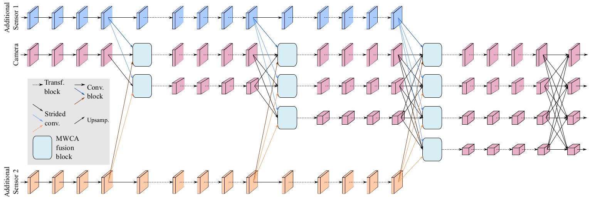

## HRFuser: A Multi-resolution Sensor Fusion Architecture for 2D Object Detection

**by [Tim Broedermann](https://people.ee.ethz.ch/~timbr/), [Christos Sakaridis](https://people.ee.ethz.ch/csakarid/), [Dengxin Dai](https://vas.mpi-inf.mpg.de/dengxin/), and [Luc Van Gool](https://scholar.google.de/citations?user=TwMib_QAAAAJ&hl=en)**


**[[Paper]](https://arxiv.org/pdf/2206.15157.pdf)**
**[[arXiv]](https://arxiv.org/abs/2206.15157)**
**[[Supplement]](Supplementary_Material_HRFuser.pdf)**

## Overview

This repository contains the official code for the **ITSC 2023** paper [HRFuser: A Multi-resolution Sensor Fusion Architecture for 2D Object Detection](https://arxiv.org/pdf/2206.15157.pdf). 
HRFuser is a multi-resolution sensor fusion architecture that scales straightforwardly to an arbitrary number of input modalities. The design of HRFuser is based on state-of-the-art high-resolution networks for image-only dense prediction and incorporates a novel multi-window cross-attention block as the means to perform fusion of multiple modalities at multiple resolutions.




### Contents

1. [Requirements](#requirements)
2. [Prepare Datasets](#prepare-datasets)
3. [Inference](#inference)
4. [Training](#training)
5. [Evaluation](#evaluation)
6. [Framework Structure](#framework-structure)
6. [Citation](#citation)
5. [Acknowledgments](#acknowledgments)

## Requirements

We tested the code on Linux with
- python 3.7.4
- pytorch 1.6.0
- torchvision 0.7.0
- cuda 10.1.243
- gcc 6.3.0

Installation:

```
pip install mmcv-full==1.3.17 -f https://download.openmmlab.com/mmcv/dist/cu101/torch1.6.0/index.html
pip install -r requirements/build.txt
pip install -v -e .
pip install -r requirements/hrfuser.txt
```

For alternative ways to setup your environment please refer to [mmdetection documentation](https://mmdetection.readthedocs.io/en/v2.19.1/get_started.html) for installation. For introduction to the general mmdetection framework please refer to: [MMDetection](https://github.com/open-mmlab/mmdetection)

## Prepare Datasets:

In this project we include pre-processing for two separate datasets: nuScenes and Seeing Through
Fog (Dense). You can run HRFuser with either of the one. 

For an **easy start**, we recommend to test the network with nuScenes **v1.0-mini**.

### NuScenes

1. Download [nuScenes](https://www.nuscenes.org/nuscenes#download) from the official website.
2. Move it to `data/nuscenes/`
3. Run the dataset conversion script: (adapted from [MMDetection3D](https://github.com/open-mmlab/mmdetection3d))

```
python tools/create_data.py nuscenes --root-path ./data/nuscenes --out-dir ./data/nuscenes --extra-tag nuscenes
```

Alternatively for nuScenes **v1.0-mini**:
```
python tools/create_data.py nuscenes --root-path ./data/nuscenes --out-dir ./data/nuscenes --extra-tag nuscenes --version v1.0-mini
```

### Seeing Through Fog:

1. Download SeeingThroughFog from the official [website](https://www.uni-ulm.de/en/in/driveu/projects/dense-datasets#c811669)
2. Unzip `SeeingThroughFogCompressed.zip`:

```
7z x "SeeingThroughFogCompressed.zip"
cd SeeingThroughFogCompressed
find . -mindepth 2 -type f -print -exec mv {} . \;
rm -r */
7z x "*.zip"
```

2. Rename `SeeingThroughFogCompressed` to `dense`:
```
cd ..
mv SeeingThroughFogCompressed dense
```
3. Move it to `data/dense/`:
```
mv dense [HRFuser repository]/data/
```
4. Download the already converted Seeing Through Fog .pkl files from:
```
https://drive.google.com/drive/folders/1VEtLNZqX22PhDJtQfXEF8riWv7Js9wRh?usp=sharing
```
and move them to the dense folder:
```
mv [download folder]/converted_stf_pkl_files/*.pkl data/dense/
```
5. Run the dataset conversion script: (based on [SeeingThroughFog](https://github.com/princeton-computational-imaging/SeeingThroughFog))
```
python SeeingThroughFog/tools/ProjectionTools/run_2d_projection_on_dataset.py -f RGB2Gatedv2 -t lidar_hdl64 -r data/dense/ -l all

python SeeingThroughFog/tools/ProjectionTools/Gated2RGB/run_depth_warping.py -l all
```

## Inference

We provided [pre-trained weights](https://drive.google.com/drive/folders/1e0esMyGVJndVcjbwkyUo29KlyZBtnh1f?usp=sharing) for the HRFuser on nuScenes and Seeing Through Fog. Please download the weights and move them to the `checkpoints` sub-folder.

To do inference with HRFuser run the test script:
```
python tools/test.py [path to config] [path to checkpoint] --show-dir [output_dir]
```

For Example:

HRFuser-T (nuScenes):
```
python tools/test.py configs/hrfuser/cascade_rcnn_hrfuser_t_1x_nus_r640_l_r_fusion.py checkpoints/cascade_rcnn_hrfuser_t_1x_nus_r640_l_r_fusion_latest.pth --cfg-options data.test.samples_per_gpu=1 --show-dir demo/output
```

HRFuser-T (Seeing Through Fog)
```
python tools/test.py configs/hrfuser/cascade_rcnn_hrfuser_t_1x_stf_r1248_4mod.py checkpoints/cascade_rcnn_hrfuser_t_1x_stf_r1248_4mod_latest.pth --cfg-options data.test.samples_per_gpu=1 --show-dir demo/output
```

## Training

To train HRFuser on **multiple GPUs** run:
``` 
tools/dist_train.sh [path to config] [number GPUs]
```

To train HRFuser on **one GPUs** run: 
``` 
python tools/train.py [path to config]
```

For Example:

HRFuser-T (nuScenes)
``` 
tools/dist_train.sh configs/hrfuser/cascade_rcnn_hrfuser_t_1x_nus_r640_l_r_fusion.py 4 --seed 0
```

HRFuser-B (nuScenes)
``` 
tools/dist_train.sh configs/hrfuser/cascade_rcnn_hrfuser_b_1x_nus_r640_l_r_fusion.py 6 --seed 0
``` 

HRFuser-T (Seeing Through Fog)
``` 
tools/dist_train.sh configs/hrfuser/cascade_rcnn_hrfuser_t_1x_stf_r1248_4mod.py 4 --seed 0
```

For **single gpu training**, please use the version of the corresponding config file ending on "_bn" (using 'BN' instead of 'SyncBN') and adjust the "samples_per_gpu" accordingly. To run HRFuser-T on 1 GPU:
``` 
python tools/train.py configs/hrfuser/cascade_rcnn_hrfuser_t_1x_nus_r640_l_r_fusion_bn.py --seed 0
```

## Evaluation

To evaluate the results of the HRFuser run the test script:
```
python tools/test.py [path to config] [path to checkpoint] --eval bbox
```

For Example:

HRFuser-T (nuScenes)
```
python tools/test.py configs/hrfuser/cascade_rcnn_hrfuser_t_1x_nus_r640_l_r_fusion.py checkpoints/cascade_rcnn_hrfuser_t_1x_nus_r640_l_r_fusion_latest.pth --eval bbox --cfg-options data.test.samples_per_gpu=12
```

HRFuser-T (Seeing Through Fog)
```
python tools/test.py configs/hrfuser/cascade_rcnn_hrfuser_t_1x_stf_r1248_4mod.py checkpoints/cascade_rcnn_hrfuser_t_1x_stf_r1248_4mod_latest.pth --eval bbox --cfg-options data.test.samples_per_gpu=12
```

## Framework Structure

This project is based on mmdetection version 2.19.1. For more information about the framework structure and the config system, please refer to the [mmdetection documentation](https://mmdetection.readthedocs.io/en/v2.19.1/get_started.html).

The most relevant files for HRFuser are:

- [configs/hrfuser/cascade_rcnn_hrfuser_b_1x_nus_r640_l_r_fusion.py](configs/hrfuser/cascade_rcnn_hrfuser_b_1x_nus_r640_l_r_fusion.py): Examplary config file for the HRFuser-B on nuScenes. 
- [mmdet/models/backbones/hrfuser_hrformer_based.py](mmdet/models/backbones/hrfuser_hrformer_based.py): The HRFormer-based backbone of the HRFuser.

## Citation

If you find this project useful in your research, please consider citing:

```
@article{broedermann2022hrfuser,
  title={HRFuser: A Multi-resolution Sensor Fusion Architecture for 2D Object Detection},
  author={Broedermann, Tim and Sakaridis, Christos and Dai, Dengxin and Van Gool, Luc},
  journal={arXiv preprint arXiv:2206.15157},
  year={2022}
}
```

## Acknowledgments

This project is based on the following open-source projects. We thank their
authors for making the source code publicly available.

* [MMDetection](https://github.com/open-mmlab/mmdetection)
* [MMDetection3D](https://github.com/open-mmlab/mmdetection3d)
* [MMSegmentation](https://github.com/open-mmlab/mmsegmentation)
* [SeeingThroughFog](https://github.com/princeton-computational-imaging/SeeingThroughFog)
